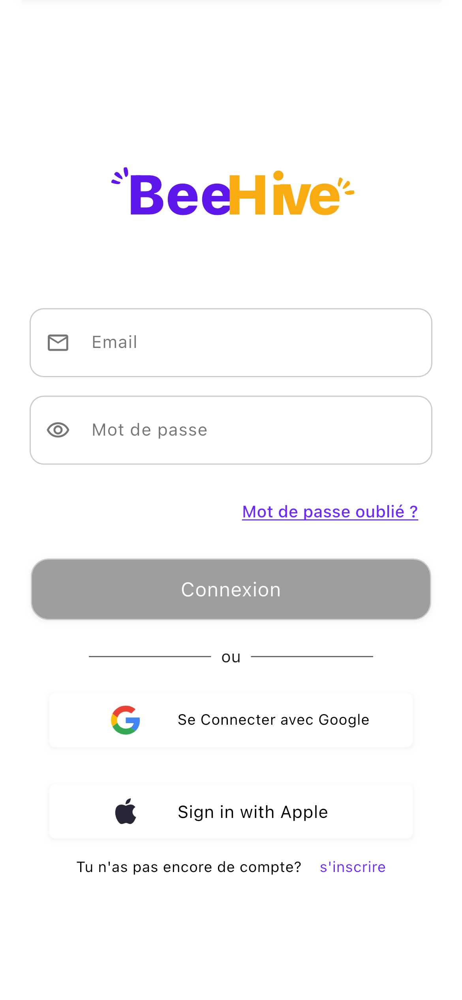
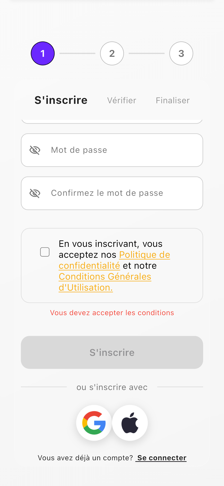
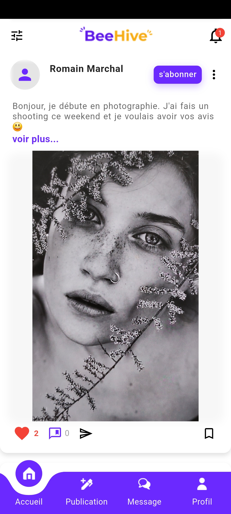

# 🐝 Beehive - Réseau Social Étudiant

Beehive est une application mobile Flutter moderne et dynamique, pensée pour connecter les étudiants dans un réseau social dédié à la collaboration, au partage et à la communication.







---

## ✨ Fonctionnalités principales

- 👥 Inscription & Connexion via Firebase (email + providers tiers : Google, Apple, Facebook)
- 🧠 Gestion des états avec **Riverpod** et **GetX**
- 📨 Notifications push via **Firebase Cloud Messaging**
- 💬 Publication, commentaires et likes
- 🎥 Appels vidéo et audio intégrés via **Agora**
- 🌐 Requêtes HTTP optimisées avec **Retrofit** + **Dio**
- 🔐 Authentification sécurisée avec gestion de session et JWT
- 📱 Design responsive et animations fluides
- 🗂️ Architecture clean, scalable et modulaire

---

## 🧰 Technologies utilisées

| Outil             | Usage                                 |
|-------------------|----------------------------------------|
| Flutter           | Framework principal mobile             |
| Riverpod          | Gestion d’état réactive (statique)     |
| GetX              | Navigation et logique de gestion d’état|
| Firebase Auth     | Authentification et fournisseurs tiers |
| Firebase FCM      | Notifications push                     |
| Firebase Firestore| Base de données temps réel             |
| Dio + Retrofit    | Client HTTP performant                 |
| Agora             | Appels vidéo/audio temps réel          |
| Cloudinary        | Upload et gestion d'images             |

---

## 🚀 Lancement du projet

### 📦 Prérequis

- Flutter SDK (3.0 ou supérieur recommandé)
- Compte Firebase + configuration Android/iOS
- Clé Agora + configuration Cloudinary

### ⚙️ Installation

```bash
# Cloner le projet
git clone https://github.com/tonprofil/beehive-app.git
cd beehive-app

# Installer les dépendances
flutter pub get
```

<table align="center"> <tr> <td align="center"> <a href="https://bafodecamara.fr/">  <br /> <sub><b>Bafode Camara</b></sub> </a> <br /> 💼 Développeur FullStack<br /> 🎓 Étudiant en Master informatique<br /> 🌍 Paris, France </td> </tr> </table>